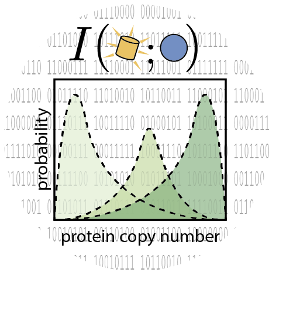

<p align="center">
  
</p>


# First-principles prediction of the information processing capacity of a simple genetic circuit 
Welcome to the GitHub repository for the channel capacity project! This
repository serves as a record for the experimental and theoretical work
described in the publication "*First-principles prediction of the information
processing capacity of a simple genetic circuit*" 

## Branches

This repository contains two main branches -- `master` and `gh-pages`. The
branch `master` which you are reading right now is the primary branch for the
project. In here you will find all of the polished and unpolished code used for
all the calculations and figure generation in the paper. The `gh-pages` branch
contains all of the [website files](https://www.rpgroup.caltech.edu/chann_cap/index.html).
What the branch `master` does not contain are the data files for the project.
But you can download such datasets from the links in the [website](https://www.rpgroup.caltech.edu/chann_cap/code).
Please see individual directories for more information.

## Installation
The intend of this repository is to make every step of the publication
completely transparent and reproducible. The project involved a significant
amount of home-grown Python code that we wrapped as a module `ccutils`. To
install the package first you need to make sure that you have all of the
required dependencies. To check for this you can use 
[`pip`](pypi.org/project/pip) by executing the following command:

``` pip install -r requirements.txt ```

Once you have all of the packages installed locally, you can install our custom
module by running the following command:

``` pip install -e ./ ```

When installed, a new folder `ccutils.egg-info` will be installed. This folder
is required for the executing of the code in this repository.

## Repository Architecture
For convenience the repository is divided into several directories and
subdirectories. Please see each directory for information regarding each file.

### **`src`**
This folder contains all the source code used for the project. From the
processing of the raw microscopy images, to the generation of all figures. The
directory is broken up into the following subdirectories:
1. **`channcap_exp` \|** contains the processing of all of the single-cell
   fluorescence data used to determine the experimental channel capacity of the
   different strains.
2. **`figs` \|** contains all the scripts to reproduce every plot in the main
   text and in the supplementary material.
3. **`image_analysis` \|** contains scripts used to process the raw microscopy
   images in order to segment the cells and extract single-cell fluorescence
   values.
4. **`theory` \|** contains Jupyter notebooks and scripts for all theoretical
   calculations in the paper. From symbolic computations using `sympy`, to
   numerical integration of dynamical equations, to the approximation of
   distributions using the maximum entropy principle.

### **`templates`**
This folder contains templates for all the routine analysis used in the
project. From the metadata file that goes along the microscopy images, to the
analysis pipeline to extract single-cell fluorescence values.

### **`data`**
This folder contains all the raw and processed data generated from the
experimental microscopy images as well as the numerical computations derived
from the theoretical model. Although not all of the content of this folder is
sync with the `GitHub` repository, all the scripts require the following
structure in order for them to run accordingly. The raw data can be directly
downloaded from the 
[paper website](https://www.rpgroup.caltech.edu/chann_cap/code) where we
indicate in which of the following folders each of the datasets should be
stored.
1. **`csv_channcap_bootstrap` [not sync] \|** This folder contains all of the
   experimental channel capacity inferences done on the single-cell microscopy
   data. These files can be downloaded 
   [here](https://data.caltech.edu/records/1185).
2. **`csv_gillespie` [not sync] \|** This folder stores the output of the
   Gillespie simulations of the chemical master equation. The files can be
   directly generated by running the following [jupyter notebook](https://www.rpgroup.caltech.edu//chann_cap/software/gillespie_simulation.ipynb).
3. **`csv_maxEnt_dist` \|** This folder contains three types of
   files:
   1. Values of mRNA and protein distributions as computed from integrating the
      moment equations.
   2. Value of the Lagrange multipliers needed to approximate the full molecule
      count distribution.
   3. Theoretically inferred channel capacity.
4. **`csv_microscopy` \|** This folder contains the processed single-cell
   fluorescence intensities.
5. **`mRNA_FISH` \|** This folder contains the single-molecule mRNA counts from
   [Jones et al, 2014](https://science.sciencemag.org/content/346/6216/1533).
6. **`microscopy` [not sync] \|** This folder contains all of the raw
   microscopy images. The files can be directly downloaded 
   [here](https://data.caltech.edu/records/1184).

## License


All creative works (writing, figures, etc) are licensed under the [Creative
Commons CC-BY 4.0](https://creativecommons.org/licenses/by/4.0/) license. All software is distributed under the standard MIT license as follows

```
Copyright 2020 The Authors 

Permission is hereby granted, free of charge, to any person obtaining a copy
of this software and associated documentation files (the "Software"), to deal
in the Software without restriction, including without limitation the rights
to use, copy, modify, merge, publish, distribute, sublicense, and/or sell
copies of the Software, and to permit persons to whom the Software is
furnished to do so, subject to the following conditions:

The above copyright notice and this permission notice shall be included in
all copies or substantial portions of the Software.

THE SOFTWARE IS PROVIDED "AS IS", WITHOUT WARRANTY OF ANY KIND, EXPRESS OR
IMPLIED, INCLUDING BUT NOT LIMITED TO THE WARRANTIES OF MERCHANTABILITY,
FITNESS FOR A PARTICULAR PURPOSE AND NONINFRINGEMENT. IN NO EVENT SHALL THE
AUTHORS OR COPYRIGHT HOLDERS BE LIABLE FOR ANY CLAIM, DAMAGES OR OTHER
LIABILITY, WHETHER IN AN ACTION OF CONTRACT, TORT OR OTHERWISE, ARISING FROM,
OUT OF OR IN CONNECTION WITH THE SOFTWARE OR THE USE OR OTHER DEALINGS IN THE
SOFTWARE.
```