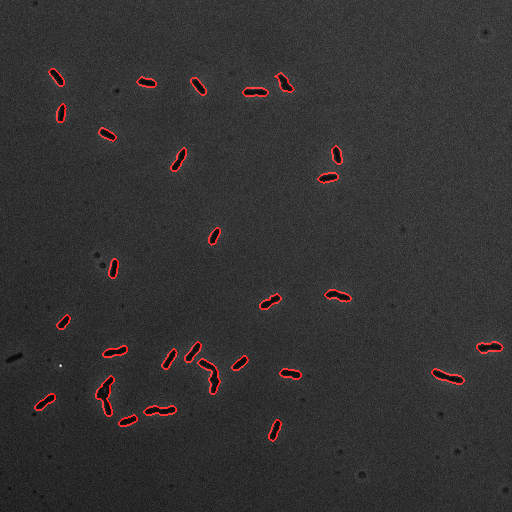
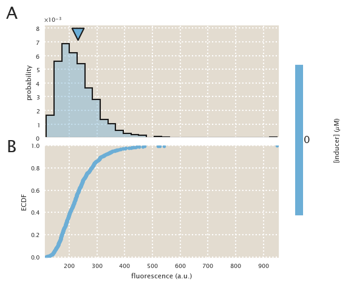
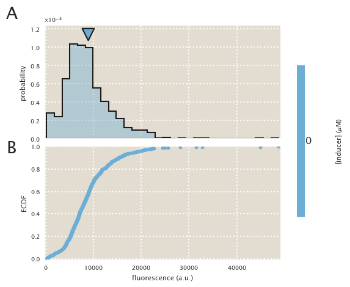

# Description
IPTG titration of the O2 - HG104 strain.

| | |
|-|-|
| __Date__ | 2016-12-04 |
| __Equipment__ | Artemis Nikon Microscope |
| __User__ | mrazomej |

## Strain infromation
| Genotype | plasmid | Host Strain | Shorthand |
| :------- | :------ | :---------- | :-------- |
| `galK<>25` | `pZS3-mCherry` | HG105 | `auto` |
| `galK<>25-O2+11-YFP` | `pZS3-mCherry` | HG105 | `delta` |
| `galK<>25-O2+11-YFP | `pZS3-mCherry` | HG104 | `HG104` |

## Titration series
| Inducer | Concentration |
| :------ | ------------: |
| IPTG | 0, 0.1, 5, 10, 25, 50, 75, 100, 250, 500, 1000, 5000 [µM] |

## Microscope settings

* 100x Oil objective
* Exposure time:
1. Brightfield : 10 ms
2. mCherry : 15 ms
3. YFP : 12 ms

## Experimental protocol

The strains were grown overnight in tubes in 3 mL of LB + spec + kan.
Next morning they were diluted 1:1000 into 0.5 mL of M9 + 0.5% glucose
in deep 96-well plates.
The auto and delta strains were grown without IPTG.
After 8 hours the cells were diluted 1:10 into M9 + glucose and imaged
using 2% agar pads also of M9 media.

## Notes & Observations

This time I marked the positions and then took the images all together.
Doing it this way reduced my experimental time for about 40 min.
Unfortunately I forgot both the YFP profile and the camera noise images
So I'll take them from 20161204.
I got confused with the naming of the images so the images with
100uM title are actually the 75uM ones, and the ones with 100realuM are
the actual 100uM images.

## Analysis files

**Example segmentation**

**ECDF (auto)**

**ECDF (∆lacI)**

**ECDF (RBS1027)**

**fold-change**

