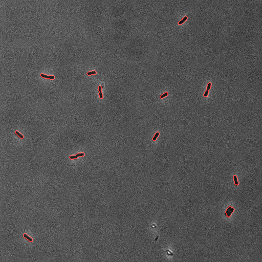
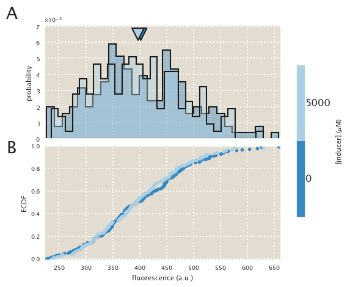
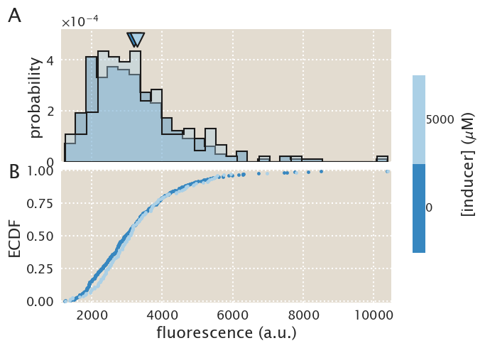
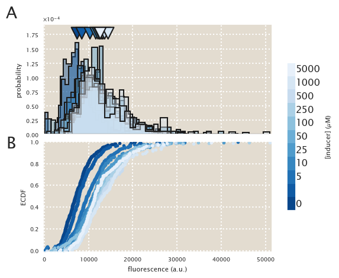
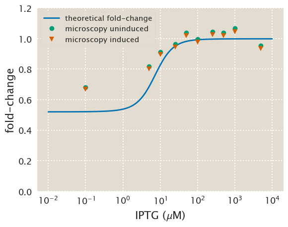

# Description
IPTG titration of the O3 - RBS1L strain.

| | |
|-|-|
| __Date__ | 2018-03-29 |
| __Equipment__ | Artemis Nikon Microscope |
| __User__ | mrazomej |

## Strain infromation
| Genotype | plasmid | Host Strain | Shorthand |
| :------- | :------ | :---------- | :-------- |
| `galK<>25` | `pZS3-mCherry` | HG105 | `auto` |
| `galK<>25-O3+11-YFP` | `pZS3-mCherry` | HG105 | `delta` |
| `galK<>25-O3+11-YFP; ybcN<>4*RBS1L-lacI` | `pZS3-mCherry` | HG105 | `RBS1L` |

## Titration series
| Inducer | Concentration |
| :------ | ------------: |
| IPTG | 0, 0.1, 5, 10, 25, 50, 75, 100, 250, 500, 1000, 5000 [µM] |

## Microscope settings

* 100x Oil objective
* Exposure time:
1. Brightfield : 3 ms
2. mCherry : 22 ms
3. YFP : 7 ms

## Experimental protocol

The strains were grown overnight in tubes in 3 mL of LB + spec + kan.
Next morning they were diluted 1:1000 into 0.5 mL of M9 + 0.5% glucose
in deep 96-well plates.
The auto and delta strains were grown without IPTG.
After 8 hours the cells were diluted 1:10 into M9 + glucose and imaged
using 2% agar pads also of M9 media.

## Notes & Observations
The RBS1L strain was grown with chloramphenicol too to avoid possible cross
contamination as the data from 20180328 suggested.
I took only 15 images per pad for most of the concentrations because by
eye I saw again as in 20180328 that the strain seemed not to be responding to
IPTG. So I thought it was not worth investing the entirety of the time to
getting the data that most likely will be discarded.  I was definitely wrong
since the data does reveal that the strain responded to IPTG

## Analysis files

**Example segmentation**

**ECDF (auto)**

**ECDF (∆lacI)**

**ECDF (RBS1L)**

**fold-change**

