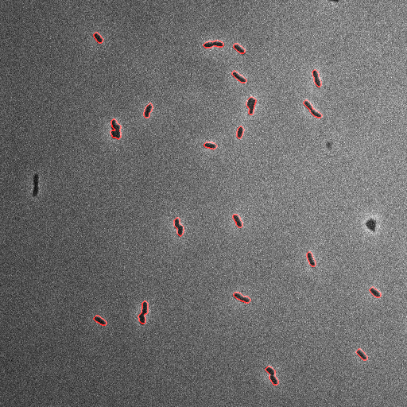
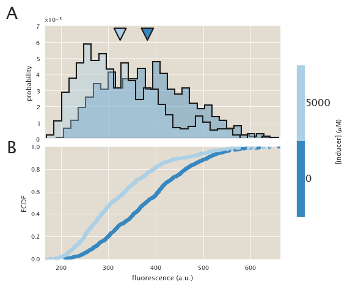
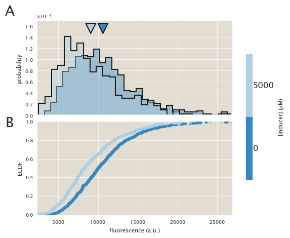
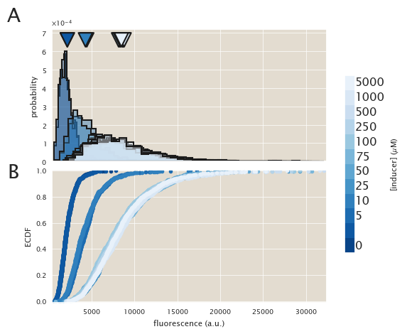
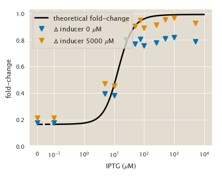

# Description
IPTG titration of the O2 - HG104 strain.

| | |
|-|-|
| __Date__ | 2018-10-25 |
| __Equipment__ | Artemis Nikon Microscope |
| __User__ | mrazomej |

## Strain infromation
| Genotype | plasmid | Host Strain | Shorthand |
| :------- | :------ | :---------- | :-------- |
| `galK<>25` | `pZS3-mCherry` | HG105 | `auto` |
| `galK<>25-O2+11-YFP` | `pZS3-mCherry` | HG105 | `delta` |
| `galK<>25-O2+11-YFP | `pZS3-mCherry` | HG104 | `HG104` |

## Titration series
| Inducer | Concentration |
| :------ | ------------: |
| IPTG | 0, 0.1, 5, 10, 25, 50, 75, 100, 250, 500, 1000, 5000 [µM] |

## Microscope settings

* 100x Oil objective
* Exposure time:
1. Brightfield : 10 ms
2. mCherry : 15 ms (power = 1 mV)
3. YFP : 15 ms

## Experimental protocol

The strains were grown overnight in tubes in 3 mL of LB + spec + kan.
Next morning they were diluted 1:1000 into 0.5 mL of M9 + 0.5% glucose
in deep 96-well plates.
The auto and delta strains were grown with 5000 uM and without IPTG.
After 8 hours the cells were diluted 1:3 into 1X PBS buffer and imaged
using 2% agar pads also of 1X PBS buffer.

## Notes & Observations

This is the first time I tried removing most of the carbon sources during the
imaging. The previous two days have given me weird results, especially
differences between the ∆lacI strains in different conditions. Therefore I
decided to try diluting the cells into 1X PBS buffer with the corresponding
IPTG concentration. The agar pads were made out of the same buffer, minimizing
the carbon available for the cells during the approx. 2 hours of imaging.
This data set was taken in reverse. Instead of starting from the
lowest concentration I started at the highest one.
## Analysis files

**Example segmentation**

**ECDF (auto)**

**ECDF (∆lacI)**

**ECDF (HG104)**

**fold-change**

