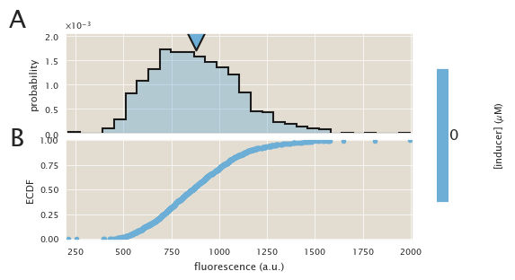
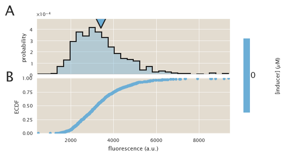
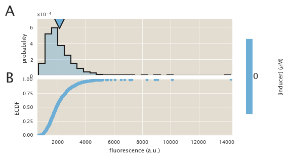

# Description
Control experiment on an LED illumination system

| | |
|-|-|
| __Date__ | 2019-06-25 |
| __Equipment__ | Nikon Microscope |
| __User__ | mrazomej |

## Strain infromation
| Genotype | plasmid | Host Strain | Shorthand |
| :------- | :------ | :---------- | :-------- |
| `galK<>25` | `pZS3-mCherry` | HG105 | `auto` |
| `galK<>25-O2+11-YFP` | `pZS3-mCherry` | HG105 | `delta` |
| `galK<>25-O2+11-YFP | `pZS3-mCherry` | HG104 | `HG104` |

## Titration series
| Inducer | Concentration |
| :------ | ------------: |
| IPTG | 0 |

## Microscope settings

* 100x Oil objective
* Exposure time:
1. Brightfield : 10 ms
2. mCherry : 500 ms
3. YFP : 5 s

## Experimental protocol

The strains were grown overnight in tubes in 3 mL of LB + spec + kan.
Next morning they were diluted 1:1000 into 0.5 mL of M9 + 0.5% glucose
in 14 mL culture tubes.
After 8 hours the cells were diluted 1:3 into 1X PBS buffer and imaged
using 2% agar pads also of 1X PBS buffer.

## Notes & Observations

The objective of this experient was to check if the more flat illumination
profile of the LED illumination system changes the single-cell fluorescence
distributions compared to the laser system.

## Analysis files

**Example segmentation**

**ECDF (auto)**

**ECDF (∆lacI)**

**ECDF (HG104)**

**fold-change**

