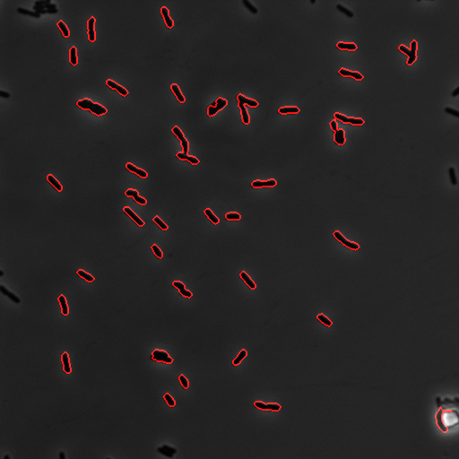
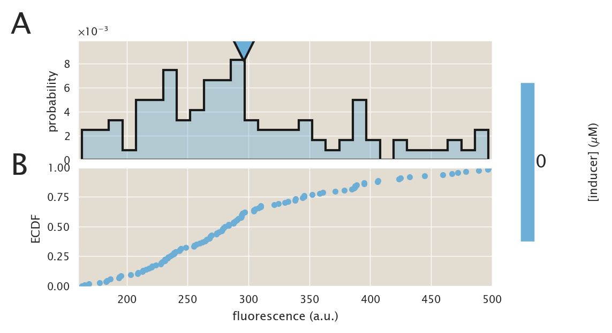
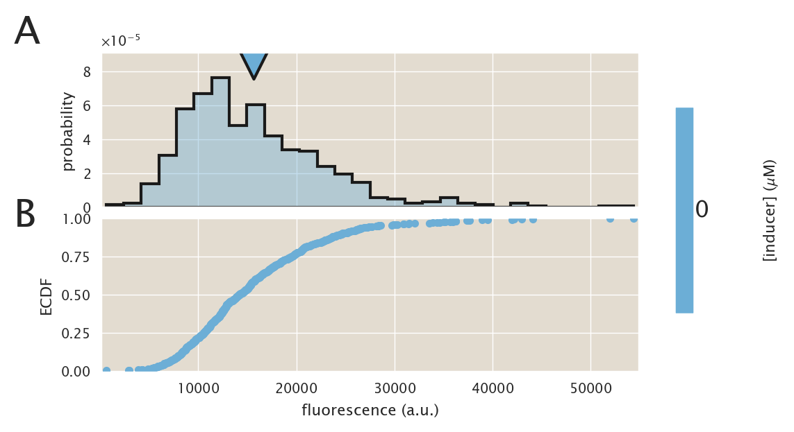

# Description
Testing a longer growth on M9 to see if a steady state
that agrees with the theory is reached. This time the overnight
culture was grown in LB + antibiotics, but for 24 hours the
cells grew in M9 after that.

| | |
|-|-|
| __Date__ | 2019-08-16 |
| __Equipment__ | Artemis Nikon Microscope |
| __User__ | mrazomej |

## Strain infromation
| Genotype | plasmid | Host Strain | Shorthand |
| :------- | :------ | :---------- | :-------- |
| `galK<>25` | `pZS3-mCherry` | HG105 | `auto` |
| `galK<>25-O2+11-YFP` | `pZS3-mCherry` | HG105 | `delta` |
| `galK<>25-O2+11-YFP` | `pZS3-mCherry` | HG104 | `HG104` |
| `galK<>25-O2+11-YFP; ybcN<>3*1-RBS1027` | `pZS3-mCherry` | HG105 | `RBS1027` |
| `galK<>25-O2+11-YFP; ybcN<>3*1-RBS1L` | `pZS3-mCherry` | HG105 | `RBS1L` |

## Titration series
| Inducer | Concentration |
| :------ | ------------: |
| IPTG | 0 |

## Microscope settings

* 100x Oil objective
* Exposure time:
1. Brightfield : 50 ms
2. mCherry : 75 ms
3. YFP : 75 ms (1 Volt power)

## Experimental protocol

The strains were grown early in the morning in tubes in 
2 mL of LB + spec + kan. Later that nights they were diluted
1:10,000 into M9 + glucose with no antibiotics. After 12 hours
of growth on this media the cells were diluted early next morning
into the same media 1:1000 for another 12 hours of growthl
I then prepared a 2% agar pad with PBS buffer and image them with the
usual imaging settings

## Notes & Observations
The cultures probably needed either a smaller dilution or a
longer growth to reach the usual density. It was hard to find enough 
fields of view with abundant cells, so some of the sets have less
amount of pictures. Also most of them were taken at the edge of the
drop where the brightfield image starts to look not that good.

## Analysis files

**Example segmentation**

**ECDF (auto)**

**ECDF (∆lacI)**

**ECDF (HG104)**

**fold-change**

